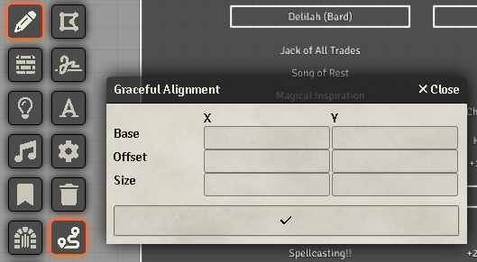

# Graceful Alignment

Utility module to help aligning canvas elements precisely.

# How to Use

First, create a bunch of text drawings. Things work better if you have them in roughly the right position, but you do not have to care that much about precise positioning or sizes.

Secondly, select a group of drawings that have a precise relationship with eachother.

Click the Graceful Alignment button under the drawings menu.

Fill in the fields required to get the behavior you want (see the section below labelled Behavior), and click the checkbox. Your drawings will be sized and positioned accordingly.

# Behaviors

1. If you provide a value for "Base X" and "Offset X", all selected elements will be sorted by their current X position (ties will then sort by their current Y position). Then, starting from the left-most element, the first element will be assigned an X position of "Base X." The next one will be "Base X" + "Offset X". Each subsequent element will be "Offset X" further right from the previous element. Basically, put them all in a horizontal line.

2. If you provide a value for "Base X" but leave "Offset X" blank, all elements will have their X value set to "Base X." This will align all of their left edges.

3. If "Base X" is not set, but "Offset X" is set, we find the element with the lowest X value, and pretend like you typed that into "Base X." Behavior is otherwise exactly the case were both were set. This also sets everything into a horizontal line, but intuits the furthest-left position instead of requiring you to provide it.

4. "Base Y" and "Offset Y" behave exactly the same as their "X" counterparts, with the logical chances.

5. Size X set: Sets the width of all selected elements equal to Size X.

6. Size Y set: Sets the height of all selected elements equal to Size Y.